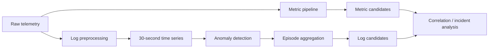
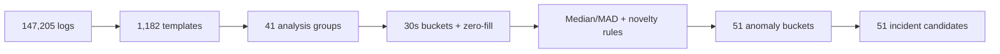

# AIOps Train Ticket Pipeline

Pipeline chuyển metric và log của hệ thống Train Ticket thành các incident candidate có thể dùng cho bước correlation.

Dataset: [Anomalies in Microservice Train Ticket](https://zenodo.org/records/6979726).

## Workflow



### Log pipeline




## Tài liệu

- [Dataset exploration](docs/01_dataset_exploration_report.md)
- [Metric detection](docs/02_metrics_detection_report.md)
- [Log preprocessing, anomaly detection và episode aggregation](docs/03_logs_preparation_report.md)

## Chuẩn bị dữ liệu

```powershell
Invoke-WebRequest -Uri "https://zenodo.org/records/6979726/files/anomalies_microservice_trainticket_version_configurations.zip?download=1" -OutFile "dataset.zip"
Expand-Archive -Path "dataset.zip" -DestinationPath "data/raw"
```

Chạy lần lượt các notebook `03_1` → `03_2` → `03_3`. Đầu ra cuối của log pipeline là `data/outputs/log_incident_candidates.json`.
