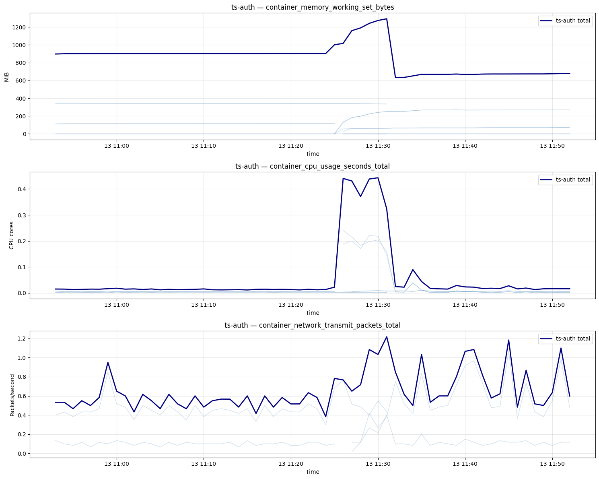
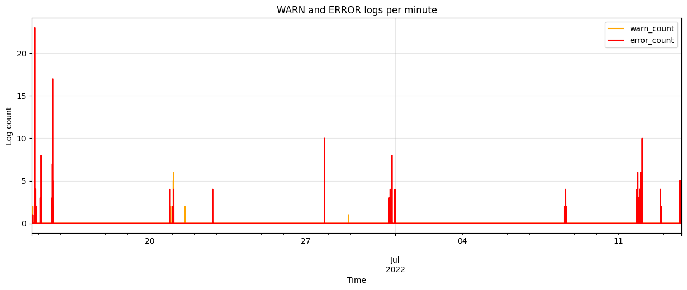

# Dataset Exploration Report

## Purpose

This report records the findings from [`notebooks/01_explore_dataset.ipynb`](../notebooks/01_explore_dataset.ipynb). It provides shared context for data loading, anomaly detection, telemetry correlation, and later root-cause analysis work.

The report is intentionally descriptive. A large value, spike, or unusual template is an observation, not yet a statistically validated anomaly. Formal detection rules belong in the detector stages.

## Executive summary

The selected scenario is complete enough for a proof of concept (PoC): it contains structured logs, seven Prometheus KPI files, and forty Jaeger trace files. The three telemetry sources can be normalized into tabular records and aligned to one-minute windows.

The strongest conclusions are:

- Metrics are stored as Prometheus Matrix JSON. Container series are usually sampled every 30 seconds; node series are usually sampled every 15 seconds.
- Logs are already parsed into structured events and templates. Template-based features should therefore be tried before text clustering.
- Traces are stored as Jaeger JSON. After cross-file deduplication, the scenario contains 378 unique spans, including two spans classified as errors.
- Log timestamps appear to be local time at UTC+8, whereas metric and trace Unix timestamps are interpreted as UTC. Subtracting eight hours from logs creates plausible alignment, but this remains an inferred assumption.
- Within the metric observation period, 25 one-minute windows contain at least logs and metrics, and 7 of those also contain traces. Logs-metrics correlation is practical; three-source correlation is possible but trace coverage is limited.

## 1. Scenario under study

| Field | Value |
|---|---|
| Scenario ID | `ts-auth-mongo_4.4.15_2022-07-13` |
| Changed microservice | `ts-auth` |
| Third-party library | `mongo` |
| Version | `4.4.15` |
| Collection date | `2022-07-13` |
| Logs available | Yes |
| Metrics available | Yes |
| Traces available | Yes |

The scenario description states that, after the version update, token-based login stopped working for normal users while remaining possible for administrators. It also warns that this behavior is not expressed clearly by the logs. This is important: absence of an explicit ERROR log is not evidence that the user-visible failure did not occur.

### Data-safety note

The anomaly-description file contains an example JWT and user identifier. Logs may therefore contain credential-like or personally identifying values. Reports, test fixtures, and model prompts should redact tokens, session identifiers, cookies, and user IDs.

## 2. File inventory

| Source | Files | Format | Preferred reader |
|---|---:|---|---|
| Raw logs | 1 | Text | Fallback only |
| Structured logs | 1 | CSV | `pandas.read_csv` |
| Log templates | 1 | CSV | `pandas.read_csv` |
| Monitoring/KPI | 7 | Prometheus Matrix JSON | Custom JSON flattener |
| Traces | 40 | Jaeger JSON | Custom JSON flattener |
| Scenario description | 1 | Text | Plain-text reader |

Structured logs should be used instead of parsing the raw text again. Metrics and traces require custom flattening because their JSON documents contain nested series, labels, traces, and spans.

## 3. Metrics findings

### 3.1 Storage model

One metric file normally corresponds to one Prometheus metric name, but it can contain thousands of time series. A time series is uniquely identified by its complete label set, such as metric name, pod, container, instance, CPU, or network interface.

The scenario and metric file names describe the **experiment context**, not the owner of every series inside the file. For example:

```text
Scenario folder:
ts-auth-mongo_4.4.15_2022-07-13

Metric file:
ts-auth-service_3_Mongo_4.4.15.json_container_cpu_usage_seconds_total.json
```

The file above stores the result of a cluster-wide Prometheus query for `container_cpu_usage_seconds_total` during the selected experiment. The actual owner of each time series must be determined from the labels inside `data.result[].metric`.

A simplified version of the JSON structure is shown below. Most labels and samples are omitted to keep the example readable:

```json
{
  "status": "success",
  "data": {
    "resultType": "matrix",
    "result": [
      {
        "metric": {
          "__name__": "container_cpu_usage_seconds_total",
          "service": "kubelet",
          "pod": "ts-auth-service-96d95d474-bdfpt",
          "container": "ts-auth-service",
          "image": "docker.io/codewisdom/ts-auth-service-with-jaeger:v1",
          "instance": "10.252.1.21:10250",
          "cpu": "total"
        },
        "values": [
          [1657711577.09, "5.737832534"],
          [1657711607.016, "12.950618888"]
        ]
      },
      {
        "metric": {
          "__name__": "container_cpu_usage_seconds_total",
          "service": "kubelet",
          "pod": "ts-auth-mongo-6765bf594-fsf44",
          "container": "ts-auth-mongo",
          "image": "docker.io/library/mongo:4.4.15",
          "instance": "10.252.1.23:10250",
          "cpu": "total"
        },
        "values": [
          [1657711596.984, "2.003522884"],
          [1657711626.984, "2.165104171"]
        ]
      }
    ]
  }
}
```

The two entries belong to different containers even though they are stored in the same scenario metric file:

- `pod=ts-auth-service-*`, `container=ts-auth-service`: the authentication application.
- `pod=ts-auth-mongo-*`, `container=ts-auth-mongo`: its MongoDB dependency.

The same file also contains series for unrelated workloads and Kubernetes infrastructure. Therefore, filtering must use the internal labels rather than the scenario prefix or file name.

In this report:

- `series_count` is the number of distinct labeled time series.
- `count` is the total number of timestamp-value samples across those series.
- A missing pod/container label does not mean that the sample value is missing. Node-level and infrastructure series often do not carry workload labels.

### 3.2 Metric inventory

| Metric | Prometheus service label | Series | Samples | Median interval | Missing value rate |
|---|---|---:|---:|---:|---:|
| `container_cpu_usage_seconds_total` | `kubelet` | 2,438 | 263,925 | 30 s | 0.00 |
| `container_memory_working_set_bytes` | `kubelet` | 3,433 | 367,905 | 30 s | 0.00 |
| `container_network_transmit_packets_total` | `kubelet` | 6,422 | 645,817 | 30 s | 0.00 |
| `node_cpu_seconds_total` | `node-exporter` | 632 | 151,680 | 15 s | 0.00 |
| `node_memory_MemAvailable_bytes` | `node-exporter` | 10 | 2,400 | 15 s | 0.00 |
| `node_memory_MemTotal_bytes` | `node-exporter` | 10 | 2,400 | 15 s | 0.00 |
| `node_network_transmit_packets_total` | `node-exporter` | 70 | 16,800 | 15 s | 0.00 |

The metric files cover approximately `2022-07-13 10:53` to `11:53` UTC.

### 3.3 Service selection

The scenario folder identifies `ts-auth` as the changed service, but the metric files contain cluster-wide series. Target-service metrics must therefore be selected using workload labels such as `pod` and `container`; the Prometheus `service` label is commonly `kubelet` or `node-exporter` and is not the application service name.

Three target-service metric families were found:

- Container working-set memory
- Container CPU usage
- Container network transmit packets

> **Interpretation note — avoid reading the exploratory total as application usage.**
>
> The notebook currently selects every series whose `pod` or `container` label contains `ts-auth`. This broad match includes both the `ts-auth-service` application and its `ts-auth-mongo` database. It can also select several cAdvisor views of the same workload: the application container, the pod-level cgroup, and the `POD` sandbox container.
>
> Pod-level values already include container resource usage. Adding a container value to its pod-level value therefore counts some of the same resource more than once. For example, an application container using `100 MiB`, a pod total of approximately `105 MiB`, and a `POD` sandbox using `5 MiB` must not be interpreted as `210 MiB` of independent usage; the real pod total is approximately `105 MiB`.
>
> Consequently, the dark `ts-auth total` lines in Figure 1 are useful for locating periods of change, but they are **not** the resource usage of `ts-auth-service` alone. The memory value near `900 MiB`, for example, mixes application, MongoDB, and overlapping cgroup series. A detector must apply metric-specific selection rules and keep application and database entities separate before aggregation. CPU and memory should use one canonical container or cgroup level; pod network metrics may legitimately appear under `container="POD"` because containers in a pod share its network namespace.

### 3.4 Counter and gauge handling

CPU and network metrics ending in `_total` are cumulative counters. They should be converted to rates before analysis:

```text
rate = (current counter - previous counter) / elapsed seconds
```

For CPU, a rate of `0.25` means approximately `0.25 CPU-seconds per second`, or an average usage of one quarter of a CPU core during that interval. Memory working set is a gauge and can be analyzed directly.

Each series should be transformed independently before aggregation. Different pods are scraped at slightly different timestamps; joining their raw points into one line can create artificial saw-tooth patterns. For correlation, each series is summarized to a one-minute grid and then summed across the service. Native 15/30-second samples should still be retained for metric detection so that short spikes are not lost.



*Figure 1. Target-service metric timelines after per-series transformation and one-minute alignment. Pale lines represent individual series; the dark line is their service-level sum. CPU rises sharply around 11:26-11:31 UTC, while memory changes around the same interval. These are exploratory observations, not validated anomaly labels.*

## 4. Log findings

### 4.1 Data quality and schema

The structured log contains 147,205 rows and no missing values in the inspected columns. Its time range is `2022-06-14 17:26:35` to `2022-07-13 19:51:19` before timezone normalization.

| Field | Meaning | PoC use |
|---|---|---|
| `LineId` | Parsed line identifier | Row identity/counting |
| `Date`, `Time` | Local log time | Combine into timestamp |
| `Level` | Severity | Severity features |
| `LoggingReporter` | Thread/logger context | Optional component feature |
| `Content` | Original message | Explanation/example text |
| `EventId` | Stable template identifier | Primary detection feature |
| `EventTemplate` | Parameterized message pattern | Explanation and grouping |
| `ParameterList` | Extracted variable values | Optional enrichment |
| `Number` | Parser-specific field | Low priority until clarified |
| `Service` | Not present in the CSV | Derive from scenario metadata |

Severity distribution:

| Level | Rows | Share |
|---|---:|---:|
| INFO | 146,599 | 99.59% |
| ERROR | 458 | 0.31% |
| WARN | 148 | 0.10% |

The dataset is highly INFO-dominant. Detectors that only count WARN/ERROR records will miss changes expressed through INFO volume or template frequency.



*Figure 2. WARN and ERROR counts aggregated by minute across the full structured-log range. Error activity is sparse and bursty, while WARN records are rarer. Because the plot spans roughly one month, it provides global context rather than a focused view of the one-hour metric experiment.*

### 4.2 Template findings

There are 1,182 unique event IDs. The most common templates are dominated by framework and tracing activity:

| Event ID | Count | Level | Template summary |
|---|---:|---|---|
| `46c6d92e` | 25,695 | INFO | Span reported |
| `6a60802a` | 18,699 | INFO | Generating unique operation name |
| `6e3a69ad` | 9,864 | INFO | Request mapping registration |
| `49b33cd1` | 6,680 | INFO | Filter mapping |
| `c3bcf5f7` | 6,278 | INFO | Method mapping |

This suggests a practical first detector:

1. Aggregate `EventId` counts by service and time window.
2. Learn a baseline per event ID.
3. Detect new templates, disappearing templates, and frequency spikes.
4. Add raw message NLP only if template signals are insufficient.

The notebook's 99th-percentile WARN/ERROR threshold is exploratory only. It must not be copied directly into production without a baseline period and evaluation against labeled incidents.

## 5. Trace findings

### 5.1 Jaeger schema mapping

| Normalized field | Jaeger source | Meaning |
|---|---|---|
| `trace_id` | `traceID` | Distributed request identifier |
| `span_id` | `spanID` | Span identifier |
| `parent_span_id` | `references[].spanID` | Dependency relationship |
| `service` | `processes[processID].serviceName` | Service that emitted the span |
| `operation` | `operationName` | Operation/span name |
| `start_time` | `startTime` | Start time in microseconds |
| `duration_ms` | `duration / 1000` | Duration converted to milliseconds |
| `status_code` | `tags[http.status_code]` | HTTP result when present |
| `error` | Error tag or HTTP status >= 400 | Derived error flag |
| `warning` | `warnings` | Jaeger instrumentation warning |

The same distributed trace can be returned in several per-service JSON files. Deduplication by `(trace_id, span_id)` is therefore mandatory before counting or aggregation.

### 5.2 Observed coverage

After deduplication:

- Unique spans: 378
- Error spans: 2
- Spans carrying Jaeger warnings: 207
- Trace range: approximately `2022-07-13 11:34:34` to `11:51:19` UTC

The two error spans include:

- `ts-travel-service / queryInfo`: HTTP 500, duration about 94.3 seconds
- `ts-admin-order-service / GET`: HTTP 500, duration about 6.7 milliseconds

Many warnings concern disabled clock-skew adjustment. These are tracing-system warnings, not automatically application failures. They may also affect cross-service duration interpretation, so they should be retained as data-quality metadata rather than counted as normal application errors.

Duration percentiles calculated from very small groups are unstable. For example, p95 based on one or two spans is close to the observed maximum and should not be treated as a robust service-level baseline.

## 6. Timeline alignment and correlation feasibility

### 6.1 Timezone assumption

Raw ranges show a consistent offset:

| Source | Observed range |
|---|---|
| Logs, before correction | `2022-06-14 17:26:35` to `2022-07-13 19:51:19` |
| Metrics | approximately `2022-07-13 10:53` to `11:53` UTC |
| Traces | `2022-07-13 11:34:34` to `11:51:19` UTC |

The final log and trace timestamps match almost exactly after subtracting eight hours from logs:

```text
2022-07-13 19:51:19 local - 8 hours = 2022-07-13 11:51:19 UTC
```

This is strong evidence for a UTC+8 log timezone, but it is still an inference because the source files do not explicitly encode timezone information. The loader should make this offset configurable and preserve the original timestamp.

### 6.2 Why use one-minute windows?

One minute is a correlation window, not a scrape interval. It contains approximately:

- Four samples for 15-second node metrics
- Two samples for 30-second container metrics
- A variable number of log events
- A variable number of spans

The common window absorbs small timestamp offsets between sources and matches the temporal resolution used for log aggregation. Metric detectors may operate at native resolution and emit their results into one-minute correlation windows.

### 6.3 Coverage result

After timezone normalization and one-minute aggregation:

- Windows with at least two sources: 25
- Windows with all three sources: 7
- The major logs-metrics activity interval is around `11:25` to `11:33` UTC.
- Target-service trace observations begin at `11:34`, so traces do not cover the preceding high log-volume interval.

The notebook reports 1,026 single-source windows because logs span roughly a month while metrics cover only one hour. That global number is not a fair measure of experiment-hour coverage. Within the one-hour metric horizon, the practical coverage is:

| Available sources | One-minute windows | Interpretation |
|---:|---:|---|
| 1 | 35 | Metrics only |
| 2 | 18 | Logs + metrics |
| 3 | 7 | Logs + metrics + traces |

`available_source_count` measures presence, not anomaly evidence. A later incident candidate should be based on detector outputs such as `log_anomaly`, `metric_anomaly`, and `trace_anomaly`, while allowing one or more sources to be unavailable.

## 7. Recommended normalized data contracts

### Logs

```text
timestamp, service, level, logger, content,
event_id, event_template, parameters, scenario_id
```

### Metrics

```text
timestamp, metric_name, value, series_id,
service_label, pod, container, instance, scenario_id
```

The complete Prometheus label dictionary should also be preserved because future metrics may require labels not selected in the initial table.

### Traces

```text
trace_id, span_id, parent_span_id, service, operation,
start_time, duration_ms, status_code, error, warning, scenario_id
```

All normalized tables should retain source-file provenance and original timestamps for auditability.

## 8. Configuration implications

Suggested initial configuration concepts:

```yaml
telemetry:
  canonical_timezone: UTC
  log_utc_offset_hours: 8  # inferred; validate for each dataset family

metrics:
  observed_intervals_seconds: [15, 30]

correlation:
  window_size_seconds: 60
  minimum_available_sources: 2
```

A single global metric sampling interval would be misleading because container and node metrics have different observed intervals.

## 9. Implications for subsequent stages

### Data loader

- Implement separate CSV, Prometheus Matrix JSON, and Jaeger JSON readers.
- Normalize timestamps to UTC while preserving original values and timezone assumptions.
- Deduplicate trace spans across files.
- Preserve Prometheus labels and source-file provenance.
- Validate required fields and report malformed/empty source files.

### Metrics detector

- Filter application series by pod/container labels rather than the Prometheus `service` label.
- Compute counter rates per series before aggregation.
- Treat gauges and counters differently.
- Detect at native sampling resolution, then aggregate detector evidence for correlation.

### Logs detector

- Start with event-template count features by minute.
- Model INFO-template volume as well as WARN/ERROR counts.
- Redact sensitive parameter values before persistence or display.

### Traces detector

- Aggregate by service, operation, and time window.
- Use span count, error count/rate, duration statistics, and slow-span count.
- Require enough samples before treating p95/p99 as reliable.
- Keep instrumentation warnings separate from application errors.

### Correlation

- Outer-join detector outputs on canonical time window and service.
- Do not require all three telemetry sources.
- Distinguish source availability from anomaly evidence.
- Treat three-source agreement as stronger evidence, not a mandatory gate.

## 10. Limitations and open questions

1. The UTC+8 log offset is inferred rather than declared by source metadata.
2. Trace coverage is short and sparse relative to logs and metrics.
3. The anomaly description says the failure is not explicit in logs, so behavioral validation may require request-level or ground-truth data.
4. Metric plots are exploratory; no formal baseline or anomaly score has been evaluated yet.
5. Trace percentiles are unreliable for low-count service-operation windows.
6. Scenario folder naming is not fully uniform across the complete dataset and requires a defensive parser.
7. The semantic meaning of the structured-log `Number` field remains unresolved.

## 11. PoC readiness conclusion

The scenario is suitable for building and demonstrating the pipeline, with qualifications:

- **Strong:** structured log completeness, metric breadth, native timestamps, and logs-metrics overlap.
- **Usable with care:** trace evidence and three-source correlation.
- **Must be explicit:** timezone inference, sparse trace statistics, counter-rate conversion, and sensitive log redaction.

The next implementation step should be a deterministic data loader that reproduces the normalized tables described above. Detection logic should then be developed independently for each telemetry source before correlation is attempted.
