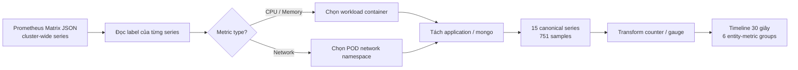
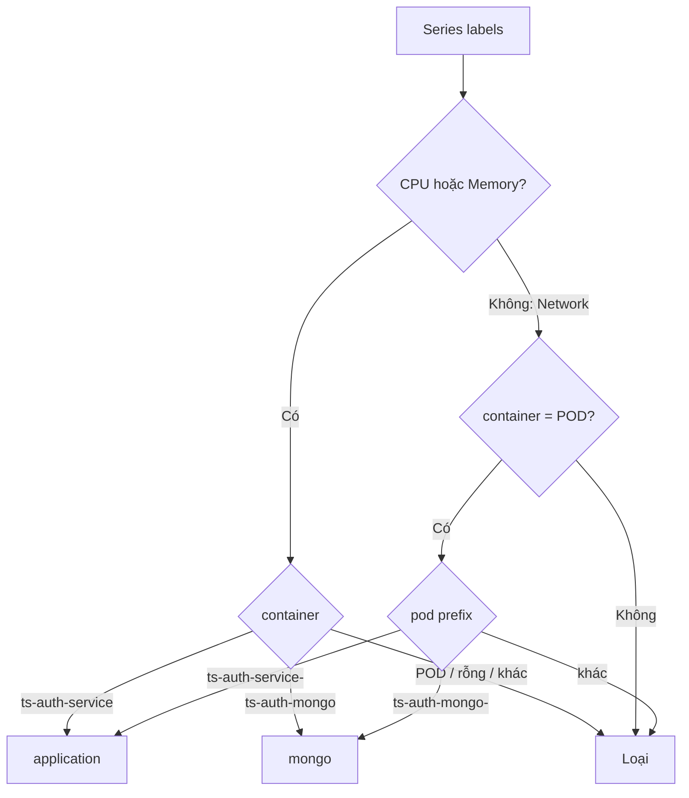

# Canonical metric series report

## Mục tiêu

Chuyển dữ liệu Prometheus cấp cluster thành tập metric có **đúng workload, đúng cấp đo và không đếm trùng**, phục vụ anomaly detection cho hai thành phần:

- `application`: dịch vụ `ts-auth-service`;
- `mongo`: dependency `ts-auth-mongo`.

Scenario được xử lý là `ts-auth-mongo_4.4.15_2022-07-13` trong [`02_metrics_detection.ipynb`](../notebooks/02_metrics_detection.ipynb).

## Workflow tổng quan



Canonical selection giải quyết ba vấn đề trước khi phân tích:

1. Tên file mô tả scenario, không đảm bảo mọi series bên trong thuộc `ts-auth`.
2. Một pod có thể xuất hiện đồng thời ở container-level và pod-level, gây đếm trùng tài nguyên.
3. `ts-auth-service` và `ts-auth-mongo` là hai operational entity cần được theo dõi riêng.

## 1. Cách chọn canonical series

Mỗi phần tử `data.result[]` trong Prometheus Matrix là một time series gồm:

```text
metric labels  -> series này đo cái gì và thuộc workload nào
values[]       -> các cặp timestamp và giá trị của series
```

Pipeline phân loại bằng label trước, sau đó mới mở rộng `values[]` thành từng sample. Quy tắc chính:

| Metric | Application | MongoDB | Loại bỏ |
|---|---|---|---|
| CPU | `container == "ts-auth-service"` | `container == "ts-auth-mongo"` | `POD`, container rỗng, pod cgroup |
| Memory | `container == "ts-auth-service"` | `container == "ts-auth-mongo"` | `POD`, container rỗng, pod cgroup |
| Network | `container == "POD"` và pod prefix `ts-auth-service-` | `container == "POD"` và pod prefix `ts-auth-mongo-` | Pod ngoài hai entity |

CPU và memory dùng workload-container level để đo tài nguyên của container thực. Network dùng `container="POD"` vì các container trong pod chia sẻ network namespace; ownership được xác định thêm bằng prefix của label `pod`.



Quy tắc này tránh cộng đồng thời container usage và pod total. Ví dụ, nếu application container dùng 100 MiB và pod total là 105 MiB, cộng cả hai thành 205 MiB sẽ đếm lại cùng một lượng memory. Canonical selection chỉ giữ cấp đo đã định nghĩa.

## 2. Dữ liệu sau khi chuẩn hóa

Mỗi sample được lưu ở long format và vẫn giữ provenance:

| Field | Ý nghĩa |
|---|---|
| `timestamp` | Unix timestamp được chuyển sang UTC |
| `value` | Giá trị Prometheus dạng số |
| `series_id` | Định danh source series, bảo toàn ranh giới giữa các pod/lifecycle |
| `entity` | `application` hoặc `mongo` |
| `metric_name` | CPU, memory hoặc network metric |
| `pod`, `container`, `image`, `instance` | Label nguồn để kiểm tra và truy vết |

Kết quả canonical selection:

| Entity | Metric | Series | Samples |
|---|---|---:|---:|
| Application | CPU | 2 | 130 |
| Application | Memory | 2 | 132 |
| Application | Network | 2 | 130 |
| MongoDB | CPU | 3 | 119 |
| MongoDB | Memory | 3 | 121 |
| MongoDB | Network | 3 | 119 |
| **Tổng** | **6 logical groups** | **15** | **751** |

Nhiều series trong cùng một group phản ánh các pod identity hoặc lifecycle khác nhau, không có nghĩa tất cả pod cùng hoạt động trong toàn bộ khoảng quan sát.

## 3. Chuẩn hóa tín hiệu cho detector

Ba metric không thể dùng trực tiếp theo cùng một cách:

| Metric | Kiểu Prometheus | Cách xử lý |
|---|---|---|
| `container_cpu_usage_seconds_total` | Counter tích lũy | Tính delta theo thời gian thành CPU cores |
| `container_memory_working_set_bytes` | Gauge tức thời | Giữ giá trị, đổi sang MiB |
| `container_network_transmit_packets_total` | Counter tích lũy | Tính delta theo thời gian thành packets/second |

Delta luôn được tính độc lập trong từng `series_id`, không nối giá trị cuối của pod cũ với giá trị đầu của pod mới. Sau đó dữ liệu được đưa về bucket 30 giây và tổng hợp theo `entity × metric_name`.


Hình trên thể hiện sáu group canonical. `value_sum` mô tả tổng hoạt động của entity; `value_mean` mô tả trung bình trên các source series đang quan sát. Timeline này là đầu vào có semantics rõ ràng cho các bước rolling baseline và anomaly detection tiếp theo.

## 4. Kiểm tra chất lượng

Notebook kiểm tra trực tiếp các invariant sau:

- CPU và memory phải có workload-container label hợp lệ và không được dùng `container="POD"`.
- Network phải dùng `container="POD"` trong schema hiện tại.
- Một `series_id` chỉ thuộc một entity.
- Application và MongoDB luôn được giữ thành hai nhóm riêng.
- Mọi sample giữ được source labels để audit quyết định chọn series.

Nếu schema label thay đổi, assertion sẽ dừng pipeline thay vì âm thầm tạo metric sai semantics.

## Kết luận

Canonical metric pipeline đã hoàn thành việc chuyển Prometheus cluster telemetry thành **sáu entity-metric groups có định nghĩa rõ ràng**, gồm CPU, memory và network cho application và MongoDB.

Từ tập series cấp cluster, pipeline đã:

- loại bỏ các workload ngoài phạm vi và các cấp đo chồng lấn;
- tách chính xác `ts-auth-service` khỏi `ts-auth-mongo`;
- giữ lại 15 canonical source series với 751 samples có provenance đầy đủ;
- chuẩn hóa counter và gauge về các đơn vị có thể phân tích;
- tạo timeline 30 giây nhất quán cho metric anomaly detection.

Kết quả đáp ứng mục tiêu của giai đoạn metric preparation: mỗi giá trị đầu vào detector đều xác định được **thuộc entity nào, đo metric gì, ở cấp Kubernetes nào và đến từ source series nào**. Đây là nền tảng chính thức để tạo `metric_incident_candidates.json` và correlation với log candidates.

Các mapping `ts-auth-service`, `ts-auth-mongo` và quy tắc container/POD là **canonical policy baseline của dataset hiện tại**. Khi áp dụng cho môi trường khác, policy cần được cấu hình theo label schema mới; contract dữ liệu và nguyên tắc không chồng lấn vẫn được giữ nguyên.
