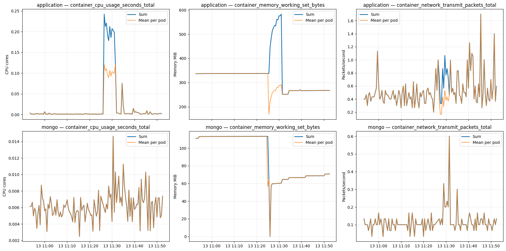

# Metrics Detection Report: Signal Preparation and Observed Behavior

## Purpose and scope

This report records the metric-processing results observed in [`notebooks/02_metrics_detection.ipynb`](../notebooks/02_metrics_detection.ipynb) for scenario `ts-auth-mongo_4.4.15_2022-07-13`. It covers notebook stages 1–7: scenario setup, canonical-series loading, signal transformation, resampling, entity-level aggregation, timeline inspection, and detection-feature preparation.

Canonical selection is summarized here only where it affects the analysis. Its motivation, label semantics, and selection policy are documented separately in [Canonical Metric Series Selection](02_canonical_metric_series.md). Validation assertions are intentionally outside the scope of this report.

At this stage the notebook has not yet applied an anomaly detector. Terms such as *spike*, *drop*, and *transition* describe visible behavior relative to the surrounding observations; they are not detector-confirmed anomalies.

## 1. Scenario and analysis configuration

The notebook analyzes telemetry under:

```text
data/raw/ts-auth-mongo_4.4.15_2022-07-13
```

The analysis separates two operational entities:

- `application`: the `ts-auth-service` workload;
- `mongo`: the MongoDB workload used by the service.

For each entity, three Prometheus metrics are retained:

| Metric | Raw type | Analysis unit |
|---|---|---|
| `container_cpu_usage_seconds_total` | Counter | CPU cores |
| `container_memory_working_set_bytes` | Gauge | MiB |
| `container_network_transmit_packets_total` | Counter | Packets/second |

The common resampling interval is 30 seconds. Counter observations separated by more than 90 seconds are treated as an invalid rate interval.

## 2. Canonical metric input

Prometheus exports several labeled views of the same Kubernetes workload. The notebook therefore selects one intended representation for each entity and metric before expanding the samples:

- CPU and memory use the workload-container series;
- network uses the pod network-namespace series (`container="POD"`);
- application and MongoDB remain separate entities.

The full rationale is in [Canonical Metric Series Selection](02_canonical_metric_series.md).

The selected input contains **751 timestamped samples** across **15 lifecycle-specific source series**:

| Entity | Metric | Source series | Distinct pods | Samples |
|---|---|---:|---:|---:|
| application | CPU | 2 | 2 | 130 |
| application | Memory | 2 | 2 | 132 |
| application | Network transmit | 2 | 2 | 130 |
| mongo | CPU | 3 | 3 | 119 |
| mongo | Memory | 3 | 3 | 121 |
| mongo | Network transmit | 3 | 3 | 119 |

The inventory includes multiple pod identities over the observation period. This does not mean all listed pods were active simultaneously; later time-bucket counts describe which series were actually observed at each timestamp.

## 3. Transformation into analysis signals

Raw Prometheus values are not directly comparable across metric types. CPU and network are cumulative counters, while memory is an instantaneous gauge.

For each `series_id`, samples are ordered by timestamp and transformed independently. Keeping series boundaries prevents a delta from being calculated between two different pods or metric lifecycles.

For CPU and network:

```text
elapsed_seconds = current_timestamp - previous_timestamp
counter_delta   = current_value - previous_value
signal_value    = counter_delta / elapsed_seconds
```

This produces CPU cores for CPU usage and packets per second for network transmit activity. A rate is discarded when the counter decreases, the time interval is non-positive, the interval exceeds 90 seconds, or there is no previous observation.

For memory:

```text
signal_value = value_bytes / 1024²
```

This converts the gauge directly to MiB without differencing.

### Observed transformation quality

| Entity | Metric | Rows | Valid signals | Counter resets | Invalid gaps |
|---|---|---:|---:|---:|---:|
| application | CPU | 130 | 128 | 0 | 0 |
| application | Memory | 132 | 132 | 0 | 0 |
| application | Network transmit | 130 | 128 | 0 | 0 |
| mongo | CPU | 119 | 116 | 0 | 0 |
| mongo | Memory | 121 | 121 | 0 | 0 |
| mongo | Network transmit | 119 | 116 | 0 | 0 |

No negative counter delta or excessive timestamp gap was observed. CPU and network have one unavailable rate at the start of each source series because a first counter sample has no preceding value. This explains the differences of two samples for application and three for MongoDB. Memory remains valid from its first sample because it is a gauge.

## 4. Resampling and entity-level aggregation

Each transformed series is resampled independently into 30-second buckets. If a bucket contains multiple valid observations, their mean becomes the bucket value. Empty buckets are removed; the notebook does not interpolate missing values.

The resampled series are then grouped by:

```text
timestamp × entity × metric_name × unit
```

This changes the analytical level from individual source series to an entity-and-metric snapshot. The resulting features are:

| Feature | Interpretation |
|---|---|
| `value_sum` | Total observed resource use or activity across series |
| `value_mean` | Mean value per observed series |
| `value_median` | Typical series value, less sensitive to one high series |
| `value_max` | Highest single-series value |
| `active_pod_count` | Distinct pod labels contributing a valid value |
| `observed_series_count` | Distinct canonical series contributing a valid value |

The chart labels `value_mean` as “Mean per pod.” This interpretation is exact only when one canonical series represents each pod for a given metric. More generally, it is the mean per observed series. Likewise:

```text
value_sum = value_mean × observed_series_count
```

Consequently, a separation between sum and mean reveals a change in the number of contributing series, while a change in mean reflects a change in the workload carried by the average contributing series.

## 5. Observed normalized metric timelines



The figure contains two entities by three metrics. The blue line is total activity (`value_sum`); the orange line is mean activity per observed series (`value_mean`).

### 5.1 Application CPU

Application CPU stays near approximately 0.00–0.01 cores for most of the early period, then rises sharply around 11:26–11:31 UTC. During the elevated interval:

- total CPU reaches approximately 0.20–0.24 cores;
- mean CPU reaches approximately 0.09–0.12 cores;
- total is roughly twice the mean.

The simultaneous increase of both sum and mean shows that the elevation is not explained only by an additional contributing series: CPU use per observed series also increased substantially. The approximate 2:1 ratio indicates two contributing series during much of this interval.

After the interval, both CPU measures return close to their earlier level, apart from shorter isolated peaks.

### 5.2 Application memory

Application memory initially remains near 340 MiB, with sum and mean overlapping. Around 11:25 UTC, the two measures move in opposite directions:

- total memory rises toward approximately 580 MiB;
- mean memory initially falls to approximately 170 MiB and then increases toward 290 MiB;
- total becomes approximately twice the mean.

This is mathematically consistent with a composition change from one contributing series to two. A newly observed series with a lower initial working set can increase the total while reducing the mean. Later, the total falls to approximately 250–270 MiB and overlaps the mean again, consistent with a return to one contributing series.

The plot supports a lifecycle or topology transition, but does not identify its cause. Rollout, restart, rescheduling, or scaling are plausible hypotheses that require pod metadata or event/log evidence.

### 5.3 Application network transmit

Application network transmit is more variable than its CPU and memory baselines. Much of the series fluctuates around approximately 0.3–0.6 packets/second, with several isolated peaks. Activity becomes more volatile around and after 11:25 UTC, including peaks near 1.7 packets/second.

Sum and mean overlap for much of the timeline and separate during parts of the transition interval. This indicates that the number of contributing network series changes over time. The larger peaks describe increased transmit activity, but the plot alone cannot distinguish workload traffic from lifecycle-related communication.

### 5.4 MongoDB CPU

MongoDB CPU fluctuates primarily around approximately 0.003–0.010 cores, with a maximum visible peak near 0.015 cores around 11:30 UTC. Its sum and mean almost completely overlap, indicating one contributing canonical series at most timestamps.

MongoDB CPU does not show an elevation comparable in magnitude or duration to the application CPU interval. The strongest CPU change in this figure is therefore localized to the application side, although this observation does not establish the source of the workload.

### 5.5 MongoDB memory

MongoDB memory is initially stable near 112–114 MiB. Around 11:25 UTC it contains a one-bucket drop to approximately zero, followed by recovery to a lower range near 58–70 MiB and a gradual stepwise increase.

Because empty resampling buckets are removed with `dropna()`, the near-zero point is not simply an empty bucket converted to zero; at least one retained memory observation in that bucket was near zero. The abrupt drop and lower post-transition baseline are consistent with a MongoDB series or process lifecycle change, but restart and deployment evidence is needed before assigning a cause.

The sum and mean remain nearly coincident, so the visible level change is not explained by simultaneous aggregation of several MongoDB series.

### 5.6 MongoDB network transmit

MongoDB network transmit is generally near 0.07–0.13 packets/second, with short peaks around 11:29–11:35 UTC. The largest reaches approximately 0.6 packets/second. Sum and mean overlap almost entirely, again indicating one contributing series at most timestamps.

The MongoDB network peak occurs near the application CPU and network elevation. This temporal alignment is useful correlation evidence for later analysis, but it does not by itself prove that application activity caused the MongoDB traffic.

### 5.7 Cross-metric interpretation

The most prominent shared transition is concentrated around 11:25–11:31 UTC:

- application CPU rises sharply both in total and per-series terms;
- application memory changes composition and then settles at a lower level;
- application network activity becomes more volatile;
- MongoDB memory changes baseline;
- MongoDB network produces short peaks while MongoDB CPU increases only modestly.

This combination is compatible with a workload and deployment/lifecycle transition occurring in the same period. It is not yet sufficient to separate a fault from an intentional rollout or scaling event. That distinction belongs to later detection and cross-signal correlation stages.

## 6. Features retained for anomaly scoring

Although the entity-level table computes sum, mean, median, and maximum, the notebook selects three numerical views for independent scoring:

```text
value_sum
value_mean
value_max
```

They preserve complementary behavior:

- `value_sum` detects a change in total entity demand;
- `value_mean` detects a change in average demand per contributing series;
- `value_max` preserves a high single-series event that aggregation could dilute.

`active_pod_count` and `observed_series_count` remain attached as context columns. They are not melted into scored values at this stage, but are essential for explaining whether a sum change coincides with scaling, lifecycle turnover, or missing observations.

`value_median` is retained in the aggregate table but is not selected by `FEATURES_TO_SCORE`. It remains available for robust descriptive comparisons or a later detector design.

## 7. Detection-ready representation and findings

The aggregate table is converted from wide to long form. Each row represents one independently scoreable stream:

```text
timestamp
entity
metric_name
feature_name
observed_value
unit
active_pod_count
observed_series_count
```

With two entities, three metrics, and three selected feature types, the downstream detector receives 18 logical streams:

```text
2 entities × 3 metrics × 3 features = 18 streams
```

The preparation stages establish the following evidence for subsequent anomaly detection:

1. Canonical selection prevents overlapping Kubernetes resource views from being added together.
2. Counter rates are calculated within source-series boundaries and no reset or excessive gap was observed.
3. All metrics share 30-second analysis buckets without synthetic interpolation.
4. Entity-level totals and per-series statistics preserve both system-wide and localized behavior.
5. A clear multi-metric transition appears around 11:25–11:31 UTC, led by application CPU and accompanied by application composition changes and MongoDB memory/network changes.
6. Pod and series counts must remain part of the evidence used to interpret any alert raised during that transition.

The next stage applies a leakage-aware rolling median and median absolute deviation detector to these streams, then consolidates its point-level output through a correlation flow.

## 8. Point anomaly detection

Each `entity × metric_name × feature_name` stream is scored independently with a rolling median and median absolute deviation (MAD) detector. Separating the streams prevents CPU, memory, network, application, MongoDB, sum, mean, and maximum observations from sharing a baseline.

### 8.1 Detector configuration

| Parameter | Value | Time interpretation at 30-second resolution |
|---|---:|---|
| `ROLLING_WINDOW` | 20 points | Up to 10 minutes of history |
| `MIN_HISTORY` | 10 points | Five minutes before a baseline is available |
| `SCORE_THRESHOLD` | 4.0 | Candidate when absolute normalized deviation reaches four scales |
| `PERSISTENCE_WINDOW` | 3 points | Inspect the current 90-second rolling state |
| `MIN_ANOMALOUS_POINTS` | 1 point | One candidate is sufficient to activate that state |

The expected value uses only prior observations:

```text
history(t)  = observed values strictly before t
expected(t) = rolling median(history(t))
```

The call to `shift(1)` is the leakage-control boundary: the current value cannot influence its own expected value.

### 8.2 Robust scale and score

The primary dispersion estimate is:

```text
robust_scale = 1.4826 × rolling MAD
```

The implementation protects nearly constant streams from a zero denominator by selecting the maximum of:

```text
robust MAD scale
rolling standard deviation
0.5% of the expected value
1e-9 absolute floor
```

The normalized score and expected band are:

```text
anomaly_score = (observed_value - expected_value) / scale
lower_bound   = expected_value - 4 × scale
upper_bound   = expected_value + 4 × scale
```

A score outside this band creates an `is_candidate` point. `is_anomaly` represents the three-point rolling state: with the current minimum of one, a single candidate can keep the state active for up to the current and following two positions. `direction` records whether the current observation lies above (`high`) or below (`low`) the baseline.

### 8.3 Interpretation limits

The output is detector evidence, not an incident count. Several details matter:

- `value_sum`, `value_mean`, and `value_max` are mathematically related and therefore are not independent votes.
- When one series contributes, `sum = mean = max`; the three detector streams are duplicate views of one signal.
- CPU baselines close to zero can produce large normalized scores from small absolute movements.
- CPU and network are visibly noisier than memory in this scenario.
- Once a spike enters rolling history, the standard-deviation fallback can widen the expected band substantially.

These limitations are why the downstream flow consolidates point fires and retains cautious names such as `possible_*` for rule-based interpretations.

## 9. Correlation flow

The correlation implementation is one processing flow with four successive grouping steps:

```text
detector anomaly points
→ feature episodes
→ entity-metric events
→ component incidents
→ scenario incident candidates
```

The common `CORRELATION_GAP` is 90 seconds. This is a **session gap**, not a fixed clock window. Two intervals join when they overlap or the next interval begins no more than 90 seconds after the current cluster ends. The clustering is transitive: if A is near B and B is near C, all three can belong to one cluster even when A and C are farther apart than 90 seconds.

### 9.1 Step 1: anomaly points to feature episodes

Point fires are first partitioned by:

```text
entity × metric_name × feature_name × direction
```

Consecutive fires separated by no more than 90 seconds become one feature episode. Keeping `direction` in the key prevents a high episode and a low episode of the same feature from being represented as one directional episode.

Each episode records:

- first and last fire time;
- duration and point count;
- largest absolute detector score and its observed value;
- minimum and maximum pod/series contributor counts;
- whether the number of metric contributors changed during the episode.

The current run produces **39 feature episodes**. Their sequential notebook IDs support in-memory debugging only and are deliberately excluded from the public JSON contract.

### 9.2 Step 2: feature episodes to entity-metric events

Episodes are then clustered by:

```text
entity × metric_name
```

Direction is no longer a grouping key. This is intentional because opposing feature directions can carry the important interpretation. For example:

```text
memory value_sum:high
memory value_mean:low
→ possible_composition_change
```

The rule function interprets combinations of `value_sum`, `value_mean`, and `value_max`:

| Pattern | Evidence shape | Cautious interpretation |
|---|---|---|
| `single_contributor_duplicate_views` | One contributing series and multiple aggregate views | Sum, mean, and max are duplicate representations |
| `possible_composition_change` | Sum high, mean low | Total rises while the average contributor falls |
| `broad_load_increase` | Sum, mean, and max high | Entity-wide and per-series load rise together |
| `distributed_load_increase` | Sum and mean high | Load increases beyond a pure contributor-count effect |
| `possible_scale_or_rollout` | Sum high, mean not fired, contributor count changed | More contributors may explain the larger total |
| `possible_isolated_series_spike` | Max high, mean not fired | Change may be concentrated in one contributor |
| `possible_lifecycle_or_telemetry_drop` | Sum low and contributor count changed | Lifecycle or telemetry availability may explain the drop |
| `broad_load_decrease` | Sum, mean, and max low | Broad decrease across aggregate views |
| `mixed_multi_feature_change` | Several unmatched feature signals | Multi-feature change without a more specific rule |
| `single_feature_change` | One fired feature | Limited single-view evidence |

“Mean not fired” means that the detector did not label mean as high or low in that event; it does not prove that mean was perfectly unchanged. Pattern names are therefore hypotheses, not root-cause labels.

The current run reduces 39 feature episodes to **9 entity-metric events**. The main transition includes:

- application CPU: `broad_load_increase`;
- application memory: `possible_composition_change`;
- MongoDB memory: `possible_lifecycle_or_telemetry_drop`;
- several single-contributor CPU/network events where sum, mean, and max must not be counted as independent evidence.

### 9.3 Step 3: metric events to component incidents

Metric events are clustered by `entity`, so temporally related CPU, memory, and network events become one component incident for either `application` or `mongo`.

The current implementation classifies only by metric coverage:

```text
1 affected metric  → single_metric_event
2 affected metrics → correlated_resource_event
3 affected metrics → multi_metric_resource_transition
```

This step currently expresses temporal co-occurrence. It does not yet implement a cross-metric symptom rule such as “CPU high + network high + latency high,” nor does it infer causality or resource dependency. The current run produces **6 component incidents**.

### 9.4 Step 4: component incidents to scenario candidates

The final grouping step clusters component incidents across entities. In this scenario, those entities are mapped later to:

```text
application → train-ticket/ts-auth-service
mongo       → train-ticket/ts-auth-mongo
```

The result receives one of two scopes:

- `entity_local`: only one entity contributes;
- `cross_entity`: both application and MongoDB contribute.

This step is also temporal grouping. It does not currently require a dependency graph or an ordered sequence such as application fire followed by MongoDB fire. That is acceptable for the current two-entity proof of concept, but a larger microservice environment would require dependency constraints, sequence/lag rules, or both to reduce accidental co-occurrence.

## 10. Correlation outcomes

The full flow reduces the detector output as follows:

```text
39 feature episodes
→ 9 entity-metric events
→ 6 component incidents
→ 3 scenario incident candidates
```

| Candidate | Interval (UTC) | Scope | Entities | Metric coverage | Point evidence | Maximum source-local score | Contributor count changed |
|---|---|---|---|---:|---:|---:|---|
| `scenario_incident_0001` | 10:59:30–11:01:00 | `entity_local` | application | 2 | 18 | 10.075789 | No |
| `scenario_incident_0002` | 11:25:00–11:33:00 | `cross_entity` | application, mongo | 3 | 61 | 578.222786 | Yes |
| `scenario_incident_0003` | 11:45:30–11:46:30 | `entity_local` | application | 1 | 9 | 4.140594 | No |

`Point evidence` is the sum of detector-state rows represented by the candidate. It is not the number of independent incidents, and it can contain related sum/mean/max views.

### 10.1 Main cross-entity candidate

`scenario_incident_0002` is the main candidate for this scenario because it:

- overlaps the known 11:25–11:31 deployment transition;
- covers application and MongoDB;
- includes CPU, memory, and network evidence;
- consolidates four component incidents into one scenario candidate;
- contains a change in the number of observed metric contributors.

In the exported artifact, `scenario_incident_0002` corresponds to candidate
`mic_b541dfeaa3ebbeea` in
[`metric_incident_candidates.json`](../data/outputs/metric_incident_candidates.json).
The timeline below is derived from its `evidence[].metric_evidence[]` entries,
using `event_time`, `feature_signals`, and `contributor_count_changed` rather
than from the summary table above.

Its internal evidence supports a cautious narrative:

1. MongoDB memory falls and its contributor membership changes around 11:25–11:27.
2. Application memory total rises while its mean falls around 11:25:30–11:28, consistent with a composition change.
3. Application CPU sum, mean, and max rise around 11:26:30–11:27:30, indicating a real per-series load increase rather than only an additional contributor.
4. MongoDB CPU/network events follow around 11:29–11:32:30.
5. Application memory produces a later low maximum event around 11:31:30–11:33.

This ordering is descriptive evidence retained by timestamps; the current flow does not yet apply it as a hard sequence rule.

### 10.2 Local candidates

The two local candidates are weaker:

- `scenario_incident_0001` combines short application CPU/network changes near 11:00. Both metrics have one contributor, so aggregate feature fires are duplicate views and may reflect noisy point detection.
- `scenario_incident_0003` is an application network-only event near 11:46 with a score only slightly above the configured threshold and no contributor-count change.

They remain in the output rather than being silently discarded. Later log/trace correlation or evaluation can strengthen, downgrade, or reject them.

## 11. Export for cross-signal correlation

The notebook exports all three candidates to:

```text
data/outputs/metric_incident_candidates.json
```

Export does not detect or correlate again. It converts the final DataFrame into a stable external representation by:

- replacing sequential scenario IDs with deterministic `mic_` identifiers;
- serializing intervals as RFC 3339 UTC;
- mapping internal entities to canonical service identities;
- embedding metric patterns and feature directions as semantic evidence;
- adding scenario, time-tolerance, schema-version, and provenance metadata;
- omitting internal feature-episode, metric-event, and entity-incident IDs.

The current mapping is one-to-one:

```text
3 scenario candidates in the correlation flow
→ 3 metric candidates in the JSON artifact
```

The JSON candidate is the representative of already-correlated metric evidence that will later be aligned with equivalent log or trace candidates. Cross-source matching should use scenario identity, overlapping or nearby UTC intervals, and intersecting canonical service keys. Raw detector scores remain source-local and must not be compared directly with log detector scores.

The normalized contract is specified in [Telemetry Incident Candidate Contract](telemetry_incident_candidate_schema.md).

## 12. Current limitations and next evaluation step

The flow is intentionally a first proof of concept:

- one 90-second session gap is reused at every grouping step;
- no fixed-window alternative has been evaluated;
- no service topology or dependency graph is enforced;
- component and scenario ordering is recorded but not used as a hard rule;
- cross-metric symptom rules have not yet been introduced;
- detector and pattern behavior has been inspected on one scenario only;
- point noise can cause high/low fires to coexist in a short event.

The next step is empirical evaluation rather than adding every possible rule upfront: run the flow on additional scenarios, record false splits, false merges, noisy patterns, and missed incidents, then introduce window, topology, or sequence constraints only where observed failure cases justify them.
