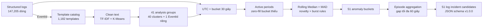
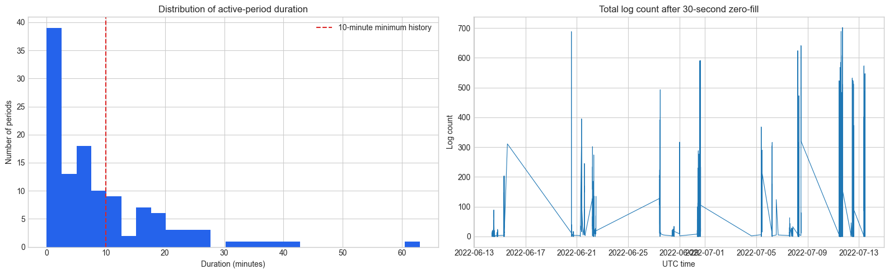
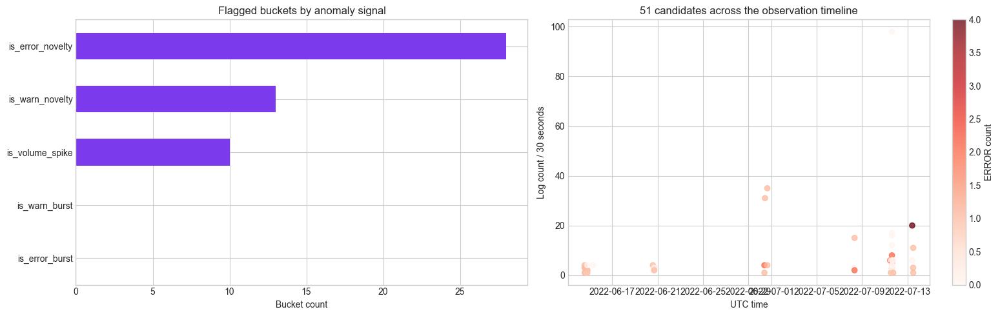

# Log anomaly detection report

## Mục tiêu

Chuyển log thô thành **incident candidate có bằng chứng truy vết**, theo ba bước:

1. Gom các log template có nội dung gần nhau thành `analysis_group`.
2. Phát hiện bucket 30 giây bất thường trong từng group.
3. Gộp các bucket gần nhau thành episode và xuất JSON cho bước correlation.

> Candidate chỉ là tín hiệu cần điều tra, chưa phải kết luận root cause hay incident thật.

## Workflow tổng quan



| Notebook | Việc chính | Đầu ra |
|---|---|---|
| [`03_1_logs_preprocessing.ipynb`](../notebooks/03_1_logs_preprocessing.ipynb) | Chuẩn hóa, semantic grouping, aggregate 30 giây | `clustered_logs.csv`, `log_cluster_timeseries.csv` |
| [`03_2_logs_anomaly_detection.ipynb`](../notebooks/03_2_logs_anomaly_detection.ipynb) | Tạo timeline đầy đủ và đánh dấu bất thường | `log_anomaly_candidates.csv`, template evidence |
| [`03_3_logs_episode_aggregation.ipynb`](../notebooks/03_3_logs_episode_aggregation.ipynb) | Gộp episode, tạo ID ổn định và document schema | `log_incident_candidates.json` |

## 1. Chuẩn bị log

### Input và kiểm tra dữ liệu

Scenario: `ts-auth-mongo_4.4.15_2022-07-13`.

| Kiểm tra | Kết quả |
|---|---:|
| Structured logs | 147,205 |
| Template catalog | 1,182 |
| `EventId` không có template | 0 |
| `LineId` trùng | 0 |
| Timestamp parse lỗi | 0 |
| Khoảng thời gian sau khi đổi sang UTC | 2022-06-14 → 2022-07-13 |

Log được nối với catalog bằng `EventId`. Nhờ vậy, semantic processing chỉ chạy một lần trên 1,182 template thay vì lặp lại trên 147,205 message.

### Gom nhóm template

- Xóa wildcard `<*>`, chuẩn hóa chữ và khoảng trắng nhưng giữ các từ vận hành như `failed`, `timeout`, `mongo`, `exception`.
- Biểu diễn 1,181 template hợp lệ bằng TF-IDF unigram + bigram.
- Thử `K = 8, 10, 12, 15, 20, 25, 30, 40`; chọn `K = 40` vì cosine silhouette cao nhất trong tập thử (`0.455844`).
- Template chỉ gồm wildcard `<*> <*>` không có nghĩa ngữ nghĩa; 345 log của nó vẫn được giữ riêng dưới group `event_dede275d`.

Kết quả là **41 `analysis_group`**: 40 semantic cluster và một EventId riêng. Cluster ID là khóa kỹ thuật, không phải nhãn nghiệp vụ ổn định.

### Aggregate theo thời gian

Mỗi log được gắn vào bucket UTC 30 giây và tổng hợp theo `service_key × analysis_group`. Mỗi dòng giữ:

`log_count`, `info_count`, `warn_count`, `error_count`, số template và số reporter khác nhau.

Kết quả: **11,039 dòng time series** từ 147,205 log gốc.

## 2. Phát hiện bất thường

Log không xuất hiện liên tục trong cả tháng, vì vậy pipeline chia timeline thành **active period**: hai vùng hoạt động cách nhau hơn 5 phút được xem là hai period khác nhau. Trong mỗi period, bucket thiếu được điền `0` để rolling baseline không hiểu nhầm “không có dòng dữ liệu” là “không biết dữ liệu”.



Detector dùng các tín hiệu bổ sung nhau:

| Tín hiệu | Cách hiểu đơn giản |
|---|---|
| Volume spike | `log_count` vượt rõ rệt so với rolling median + MAD của chính group |
| ERROR/WARN novelty | ERROR hoặc WARN xuất hiện sau khi lịch sử trước đó bằng 0 |
| ERROR/WARN burst | ERROR hoặc WARN tăng mạnh so với baseline khác 0 |

Chỉ đánh giá sau khi có tối thiểu 10 phút lịch sử trong active period. Kết quả có **51 bucket bất thường**: 28 error novelty, 13 warn novelty và 10 volume spike; không có burst được kích hoạt.



Sau khi phát hiện, pipeline map ngược bằng `time_window + service_key + analysis_group` để lấy `LineId`, `EventId`, template và message gốc. Đây là bằng chứng giúp người vận hành kiểm tra candidate.

## 3. Từ bucket đến incident candidate

Các bucket thuộc cùng `service_key × active_period × analysis_group` được gộp nếu cách nhau không quá 60 giây. Mỗi episode lưu thời điểm bắt đầu/kết thúc, tín hiệu đã kích hoạt, tổng count và template đóng góp.

Trong lần chạy hiện tại, 51 bucket tạo thành **51 episode** vì không có hai bucket cùng group đủ gần để gộp. Notebook xuất:

```text
data/outputs/log_incident_candidates.json
schema: aiops.log_incident_candidates / 1.0.0
candidates: 51
```

`candidate_id` được tạo xác định từ nội dung episode, giúp chạy lại cùng dữ liệu vẫn có ID nhất quán.

## Giới hạn cần nhớ

- Timezone nguồn đang giả định là `Asia/Shanghai`; cần đối chiếu với metric/deployment trước khi correlation.
- Toàn bộ file đang được gắn `train-ticket/ts-auth-service` theo tên file, chưa xác minh service scope từ nội dung.
- `K = 40` mới tối ưu trong các K đã thử; cluster cần được review về ý nghĩa vận hành.
- Dataset lệch mạnh về INFO (146,599/147,205), nên novelty có thể nhạy với ERROR/WARN hiếm.
- 51 candidates là kết quả rule-based cần correlation với metric và topology, không phải 51 incident đã xác nhận.

## Bước tiếp theo

Đầu ra JSON đã sẵn sàng để ghép với `metric_incident_candidates.json` theo cửa sổ thời gian và service. Trước khi dùng cho production, ưu tiên xác minh timezone/service scope và đánh giá precision trên các incident có nhãn.
